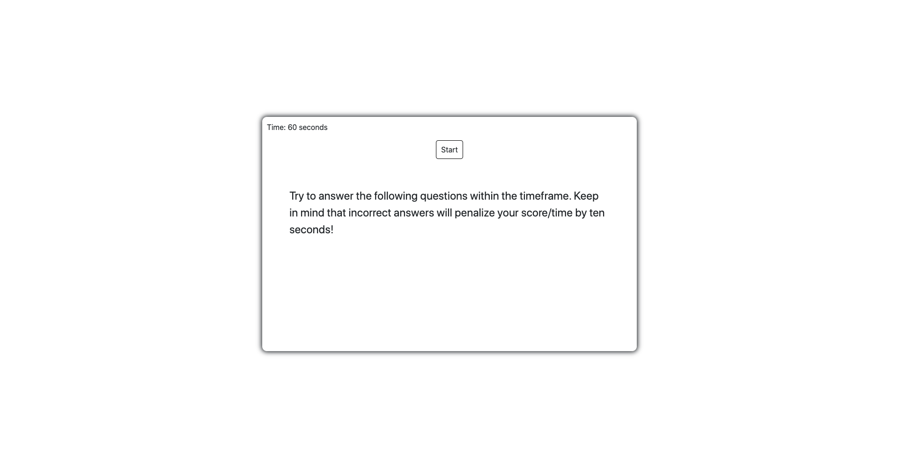
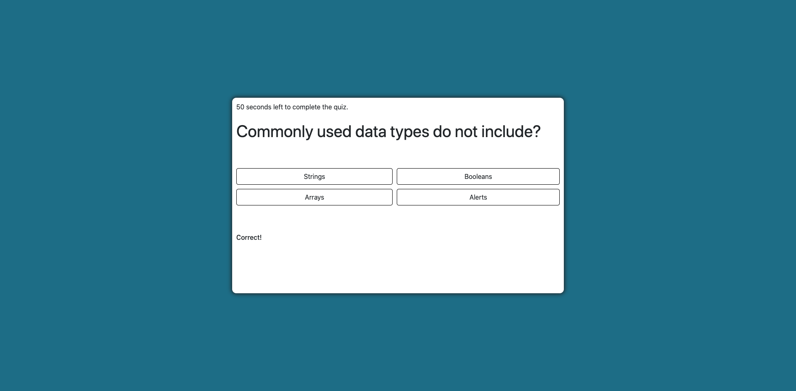
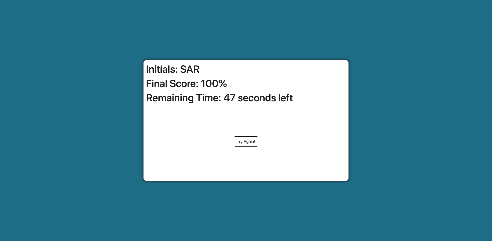

# Test your JavaScript

For this assignment, I was tasked with creating a timed coding quiz that subtracts time from the clock if an incorrect response is chosen. Additionally, the assignment called for the user's initials and final score to be saved locally.  

## I practiced the following:

1. HTML DOM traversal
2. JavaScript Timing Events
3. jQuery Selectors and Methods
4. Pushing and pulling data to and from Local Storage 
5. Additional experience with event listeners

## Screenshots
 

 

 

#### [Test Your JavaScript](https://github.com/sranson/test-your-javascript)

## Future Enhancements
1. Insert a pause between "correct"/"incorrect" notification and next question
2. Get user initials from a modal as opposed to an alert box
3. Add color palette and additional styling 

## License

Permission is hereby granted, free of charge, to any person obtaining a copy of this software and associated documentation files (the "Software"), to deal in the Software without restriction, including without limitation the rights to use, copy, modify, merge, publish, distribute, sublicense, and/or sell copies of the Software, and to permit persons to whom the Software is furnished to do so, subject to the following conditions:

The above copyright notice and this permission notice shall be included in all copies or substantial portions of the Software.

THE SOFTWARE IS PROVIDED "AS IS", WITHOUT WARRANTY OF ANY KIND, EXPRESS OR IMPLIED, INCLUDING BUT NOT LIMITED TO THE WARRANTIES OF MERCHANTABILITY, FITNESS FOR A PARTICULAR PURPOSE AND NONINFRINGEMENT. IN NO EVENT SHALL THE AUTHORS OR COPYRIGHT HOLDERS BE LIABLE FOR ANY CLAIM, DAMAGES OR OTHER LIABILITY, WHETHER IN AN ACTION OF CONTRACT, TORT OR OTHERWISE, ARISING FROM, OUT OF OR IN CONNECTION WITH THE SOFTWARE OR THE USE OR OTHER DEALINGS IN THE SOFTWARE.